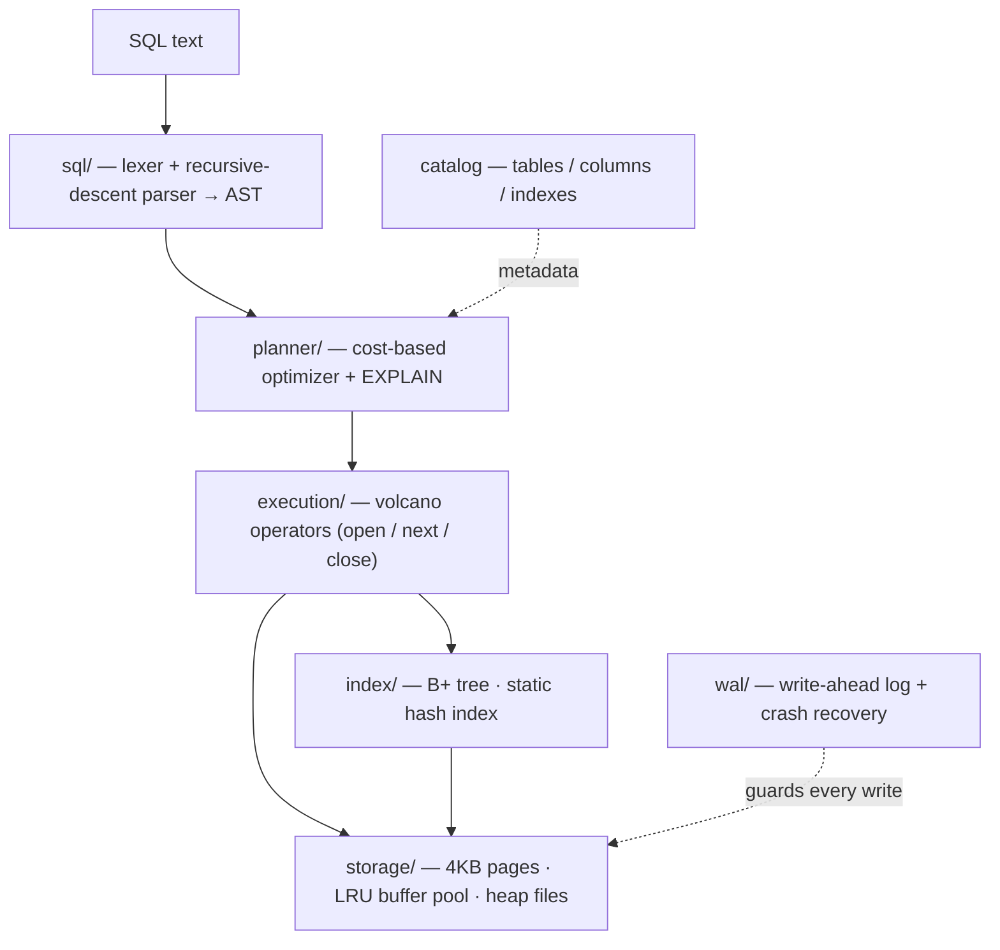
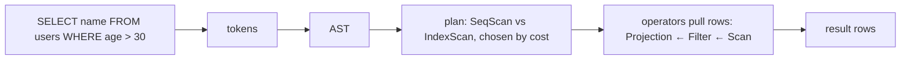

# QueryX

**A relational database engine built from scratch in Python — storage, indexes, SQL, a cost-based optimizer, and crash recovery.**


[](https://github.com/sirrj4rvis/QueryX-Engine/actions/workflows/tests.yml)


QueryX is a miniature but architecturally faithful relational database engine,
built from first principles to expose the internals that production databases
(PostgreSQL, SQLite) hide behind mature abstractions: page-based storage,
B+ tree and hash indexing, SQL parsing, volcano-model execution, cost-based
query optimization, and write-ahead logging with crash recovery. The engine
uses **only the Python standard library** — no ORM, no database libraries.

> **Status:** complete (Phases 1–9), **327 passing tests**. A working SQL
> database with paged storage, B+ tree/hash indexes, a cost-based optimizer with
> `EXPLAIN`, WAL crash recovery, a charted benchmark suite, plus `GROUP BY`/
> `HAVING`, a two-table `INNER JOIN`, and a workload-driven index advisor.

---

## Architecture

A SQL string falls **downward** through a stack of layers, getting more concrete
at each step; dependencies only ever point down (an upper layer may use a lower
one, never the reverse). A write-ahead log guards every write.



| Layer | Package | Responsibility |
|-------|---------|----------------|
| SQL | `queryx/sql/` | Tokenize and parse SQL text into an AST |
| Planner | `queryx/planner/` | Cost-based optimization; choose the cheaper plan; `EXPLAIN` |
| Execution | `queryx/execution/` | Run the plan via the volcano (iterator) model |
| Index | `queryx/index/` | B+ tree and hash index: key → row location |
| Storage | `queryx/storage/` | 4KB pages, pager, LRU write-back buffer pool, heap files |
| WAL | `queryx/wal/` | Write-ahead log + crash recovery (redo) |
| Catalog | `queryx/catalog.py` | System catalog: tables, columns, indexes |
| Facade | `queryx/database.py` | Wires the pipeline; the public `db.execute(...)` API |

### What a query goes through



---

## Feature matrix

| Component | Status |
|---|---|
| Storage — 4KB slotted pages, pager, LRU write-back buffer pool, heap files | ✅ |
| Indexes — disk-backed B+ tree (ordered range scans), static hash index | ✅ |
| SQL — hand-written lexer + recursive-descent parser → typed AST ([BNF](DESIGN.md#3-sql-grammar-bnf)) | ✅ |
| Execution — volcano operators: scan, filter, project, sort, limit, distinct | ✅ |
| Aggregates — `COUNT/SUM/AVG/MIN/MAX`, scalar and `GROUP BY` / `HAVING` | ✅ |
| Joins — two-table `INNER JOIN` (nested-loop + index-nested-loop) | ✅ |
| Optimizer — cost-based `SeqScan` vs `IndexScan`, with `EXPLAIN` | ✅ |
| Durability — write-ahead log + redo crash recovery | ✅ |
| Adaptive indexing — workload advisor (`.recommend` / `.apply`) | ✅ |
| Tests | **327 passing** |

---

## Quickstart

Requires **Python 3.11+**.

```bash
pip install -e ".[test]"     # install (stdlib-only engine; pytest for the tests)
python -m queryx mydb        # open an interactive SQL shell on the "mydb" database
pytest                       # run the full test suite (327 tests)
```

### Library API

```python
from queryx.database import Database

db = Database("mydb")  # a directory holding the catalog + table/index files
db.execute("CREATE TABLE users (id INT, name TEXT, age INT)")
db.execute("INSERT INTO users VALUES (1, 'alice', 30), (2, 'bob', 25)")

result = db.execute("SELECT name, age FROM users WHERE age >= 30 ORDER BY name")
print(result.columns)  # ['name', 'age']
print(result.rows)     # [('alice', 30)]

db.execute("SELECT COUNT(*), AVG(age) FROM users").rows  # [(2, 27.5)]
db.close()  # data persists to disk; reopen Database("mydb") to read it back
```

### Interactive shell

```
queryx> SELECT name, age FROM users WHERE age >= 30 ORDER BY name;
+-------+-----+
| name  | age |
+-------+-----+
| alice | 30  |
| carol | 30  |
+-------+-----+
(2 rows) [0.2 ms]

queryx> .stats
buffer pool
  hit ratio    : 100.0%   (5 hits / 0 misses)
storage
  data pages   : 1    index pages: 0
```

Meta-commands: `.help`, `.tables`, `.schema`, `.indexes`, `.stats` (buffer-pool
hit ratio), `.pages` (on-disk slotted-page layout), `.tree` (a B+ tree index as
static ASCII), `.recommend` / `.apply` (index advisor), `.quit`. A paste-ready
tour of every feature is in [examples/sample_queries.sql](examples/sample_queries.sql).

---

## Demos

Two single-command, narrated demos (no setup):

```bash
python examples/crash_recovery_demo.py     # WAL redo recovery after a crash
python examples/index_vs_seqscan_demo.py   # EXPLAIN + timing: index vs full scan
```

- **Crash recovery** — inserts rows, simulates a crash with no checkpoint, zeroes the data page on disk, reopens, and replays the WAL to recover the rows (byte-level before/after proof). Runs identically every time. Recovery succeeds because the corruption happens before a checkpoint — this demonstrates the WAL's redo guarantee, not protection against arbitrary disk faults (after a checkpoint the log is truncated and the page image is gone).

- **Index vs sequential scan** — on one query, `EXPLAIN` shows a `SeqScan` with
  no index, then an `IndexScan` after `CREATE INDEX`, with the measured speedup.

<!-- TODO: record a terminal GIF of the shell + crash-recovery demo and embed it here. -->

---

## Benchmarks

In-process microbenchmarks at **N = 20,000** rows (warm buffer pool, no per-op
fsync) — they show *relative* algorithmic behaviour, not production latencies,
and shift run-to-run. The numbers below match the committed
[benchmark report](benchmarks/REPORT.md); regenerate with
`python benchmarks/benchmark_suite.py`.


| operation (ops/s) | heap / seqscan | B+ tree | hash |
|---|---:|---:|---:|
| insert | 33,013 | 7,759 | 37,306 |
| point lookup | 77 | 8,459 | 21,648 |
| range scan (500-key window) | 34 | 1,350 | — |

- A hash point lookup is ~**280×** a sequential scan at this size; the B+ tree
  trails hash on point lookups but is the only index that range-scans.
- WAL overhead: page writes are ~**2.7×** slower with logging on
  (70,113 → 25,606 ops/s) — the price of crash durability.

---

## How QueryX compares to SQLite / PostgreSQL

An **architectural** comparison — how QueryX's design mirrors, and deliberately
simplifies, production engines. This is **not** a feature- or performance-parity
claim; QueryX implements the core mechanisms on a small, focused scope.

| Concept | PostgreSQL | SQLite | QueryX (this project) |
|---|---|---|---|
| Page size | 8 KB | 4 KB (default) | 4 KB |
| Record layout | slotted (item pointers) | B-tree cells | slotted pages |
| Buffer management | shared buffers, clock-sweep | page cache | LRU, write-back |
| Default index | B-tree | B-tree | B+ tree (plus a static hash index) |
| Optimizer | cost-based; histograms, MCV lists, join enumeration | cost-based | cost-based, single-table `SeqScan` vs `IndexScan`; `1/n_distinct` + magic-number selectivity |
| Durability | WAL + full-page images (ARIES-style redo/undo) | rollback / WAL journal | WAL, full-page-image **redo** replay (no undo) |
| Transactions | full ACID, MVCC | ACID | **none** — durability only; no isolation or atomic multi-statement transactions |
| System catalog | `pg_catalog` (in tables) | `sqlite_master` | JSON file |

Where QueryX simplifies, it does so on purpose — see the failure analysis and
"future work" rationale in [DESIGN.md](DESIGN.md).

---

## SQL feature scope

A **focused, fully integrated subset** — not "all SQL". Every supported command
runs through the real pipeline (parser → optimizer → executor → indexes →
storage), never string-matched.

- **Supported:** `CREATE TABLE`, `DROP TABLE`, `INSERT` (multi-row),
  `SELECT [DISTINCT] cols FROM t [JOIN t2 ON ...] WHERE <predicate>
  [GROUP BY ... HAVING ...] [ORDER BY] [LIMIT]`, `UPDATE`, `DELETE`,
  `CREATE INDEX`, `DROP INDEX`, `EXPLAIN`; comparisons `= != <> < > <= >=`
  combined with `AND OR NOT`; aggregates `COUNT(*) SUM AVG MIN MAX` with or
  without `GROUP BY`; a two-table `INNER JOIN`.
- **Deferred (see Future Work):** subqueries, `LIKE`, `IN`, joins beyond two
  tables, foreign keys, views, full three-valued `NULL` logic, and
  `BEGIN/COMMIT/ROLLBACK` transactions.

---

## Documentation

- **[DESIGN.md](DESIGN.md)** — architecture, BNF grammar, per-phase design
  decisions, complexity, Postgres/SQLite comparisons, and failure analysis.
- **[benchmarks/REPORT.md](benchmarks/REPORT.md)** — the benchmark report.
- **[RESUME.md](RESUME.md)** — resume bullet points.

---

## Future work (deliberately out of scope)

These are scope decisions, not oversights — each is a substantial subsystem that
would add tooling breadth without deepening the core internals this project
exists to demonstrate. Knowing *why* they are deferred is part of the design:

- **Transactions, MVCC, locking, isolation** — QueryX provides durability (WAL
  redo) but not atomic multi-statement transactions or concurrency control. This
  is the single biggest simplification.
- **Richer SQL** — subqueries, `LIKE`/`IN`, joins beyond two tables, foreign
  keys, views, full three-valued `NULL` logic.
- **Optimizer depth** — histograms / correlation statistics, join-order
  enumeration (only single-table access-path selection today).
- **Storage/ops** — page compaction, columnar storage, compression, parallel
  execution, plan caching, monitoring dashboards.

## License

[MIT](LICENSE).
