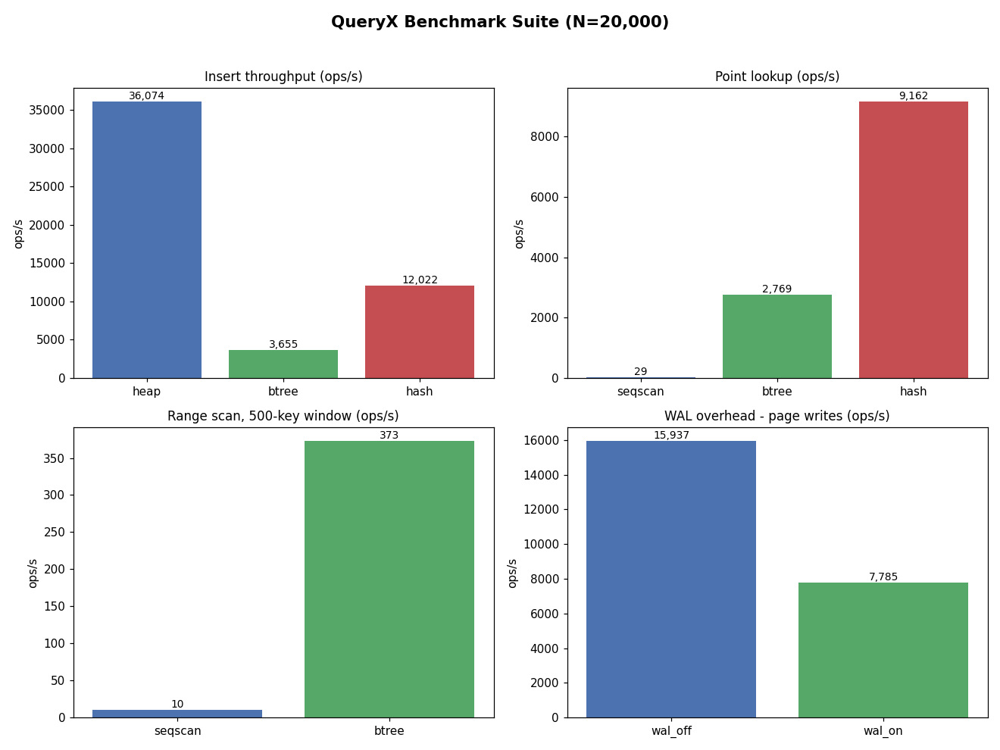

# QueryX

**A relational database engine built from scratch in Python.**

QueryX is a miniature but architecturally faithful relational database engine,
built from first principles to expose the internals that production databases
(PostgreSQL, SQLite) hide behind mature abstractions: page-based storage,
B+ tree and hash indexing, SQL parsing, volcano-model execution, cost-based
query optimization, and write-ahead logging with crash recovery.

> **Status:** Complete (Phases 1–9). A working SQL database with page storage,
> B+ tree/hash indexes, a cost-based optimizer with `EXPLAIN`, WAL crash
> recovery, a charted benchmark suite, and all three Phase 9 stretch goals —
> `GROUP BY`/`HAVING`, two-table `INNER JOIN` (nested-loop + index-nested-loop),
> and adaptive indexing. 306 passing tests.

---

## Why this exists

Most developers use databases without understanding how data is stored,
indexed, queried, optimized, and recovered after crashes. QueryX builds those
mechanisms from scratch — standard library only, no ORM, no database libraries —
to demonstrate and explain how a relational engine actually works underneath.

It is a learning-and-portfolio project: the code is written to be read,
understood, and defended on a whiteboard.

---

## Architecture at a glance

A SQL string falls **downward** through a stack of layers, getting more concrete
at each step. Dependencies only ever point down — an upper layer may use a lower
one, never the reverse.

```
            ┌───────────────────────────────────────────────┐
  SQL text  │  "SELECT name FROM users WHERE age > 30"        │
            └───────────────────────┬───────────────────────┘
                                     ▼
   ┌──────────────────────────────────────────────────────────┐
   │  sql/        Lexer -> Parser                  text -> AST  │
   ├──────────────────────────────────────────────────────────┤
   │  planner/    Statistics -> Cost-based optimizer            │
   │                                               AST -> plan  │
   ├──────────────────────────────────────────────────────────┤
   │  execution/  Volcano operators (open/next/close)           │
   │              SeqScan Filter Projection Sort Limit ...      │
   │                                              plan -> rows  │
   ├───────────────────────────────┬──────────────────────────┤
   │  index/   B+ tree / hash       │  storage/  pages, pager,  │
   │           key -> row location  │  buffer pool, heap files  │
   └───────────────────────────────┴──────────────────────────┘
                                     ▲
            ┌────────────────────────┴───────────────────────┐
            │  wal/   write-ahead log + recovery (guards all   │
            │         writes)        catalog.py  (metadata)    │
            └─────────────────────────────────────────────────┘

  Entry point:  queryx/database.py  ->  db.execute("SELECT ...")
```

| Layer | Package | Responsibility |
|-------|---------|----------------|
| SQL | `queryx/sql/` | Tokenize and parse SQL text into an AST |
| Planner | `queryx/planner/` | Cost-based optimization; choose the cheapest plan; `EXPLAIN` |
| Execution | `queryx/execution/` | Run the plan via the volcano (iterator) model |
| Index | `queryx/index/` | B+ tree and hash index: key → row location |
| Storage | `queryx/storage/` | 4KB pages, pager, buffer pool (LRU), heap files |
| WAL | `queryx/wal/` | Write-ahead log + crash recovery (redo) |
| Catalog | `queryx/catalog.py` | System catalog: tables, columns, indexes |
| Facade | `queryx/database.py` | Wires the pipeline; the public `db.execute(...)` API |

See [DESIGN.md](DESIGN.md) for the detailed design, the SQL grammar (BNF), and
per-phase engineering notes.

---

## Roadmap

- [x] **Phase 0** — Database internals study (theory).
- [x] **Phase 1** — Architecture & project skeleton.
- [x] **Phase 2** — Storage engine: 4KB pages, slotted records, pager, buffer pool, heap files.
- [x] **Phase 3** — Index manager: disk-backed B+ tree + hash index, with benchmarks.

  ```
  operation                B+ tree     hash index   heap seqscan   (N=20,000)
  bulk load (insert)     7,286 ops/s  36,635 ops/s   49,715 ops/s
  point lookup           8,480 ops/s  23,658 ops/s       38 ops/s
  range scan [500 keys]  2,205 ops/s   unsupported   (via seqscan)
  ```
  Point lookup: hash ~625x faster than a seq scan. Range scan: B+ tree only —
  a hash index has no ordering. Run: `python benchmarks/index_benchmark.py`
- [x] **Phase 4** — SQL parser: lexer + recursive-descent parser → AST (grammar in BNF).
- [x] **Phase 5** — Execution engine: volcano operators end-to-end.
- [x] **Phase 6** — Cost-based optimizer + `EXPLAIN`.

  ```
  EXPLAIN SELECT name FROM users WHERE id = 500 ORDER BY name LIMIT 3
  Limit: 3
    -> Projection: name
      -> Sort: name
        -> IndexScan using idx_id (btree) on users [id = 500]  (cost=3.4 rows=1)
  (chose IndexScan at cost 3.4; SeqScan alternative cost 7.0)
  ```
- [x] **Phase 7** — WAL + crash recovery (redo logging + replay).
- [x] **Phase 8** — Benchmark suite with matplotlib charts.
- [x] **Phase 9** — *(stretch, all three built)* `GROUP BY` + `HAVING`, two-table
  `INNER JOIN` (nested-loop + index-nested-loop), and adaptive indexing.

---

## SQL feature scope

QueryX deliberately supports a **focused, fully integrated subset** of SQL — not
"all SQL". Every supported command runs through the real pipeline (parser →
optimizer → executor → indexes → storage), never string-matched.

- **Supported:** `CREATE TABLE`, `DROP TABLE`, `INSERT`,
  `SELECT [DISTINCT] cols FROM t [JOIN t2 ON ...] WHERE <predicate>
  [GROUP BY ... HAVING ...] [ORDER BY] [LIMIT]`, `UPDATE`, `DELETE`,
  `CREATE INDEX`, `DROP INDEX`, `EXPLAIN`; comparison operators
  `= != <> < > <= >=` combined with `AND OR NOT`; aggregates
  `COUNT(*) SUM AVG MIN MAX` with or without `GROUP BY`; a two-table
  `INNER JOIN`.
- **Deferred (future work):** subqueries, `LIKE`, `IN`, joins beyond two
  tables, foreign keys, views, full three-valued `NULL` logic, and
  `BEGIN/COMMIT/ROLLBACK` transactions.

---

## Benchmarks

Measured across the three access paths plus WAL overhead. These are in-process
microbenchmarks (warm buffer pool, single machine, no per-op fsync) — they show
*relative* algorithmic behavior, not production latencies. Regenerate with
`python benchmarks/benchmark_suite.py`; full numbers in
[benchmarks/REPORT.md](benchmarks/REPORT.md).



Representative results at N = 20,000 rows:

- **Point lookup:** a hash index is ~**300x** faster than a sequential scan; the
  B+ tree trails hash but is the only index that can range-scan.
- **Range scan:** B+ tree streams the linked leaves; a hash index cannot do it
  at all.
- **Inserts:** the heap and hash index are cheap; the B+ tree is slower to build
  (it re-serializes a whole node per write — a known, documented simplification).
- **WAL:** logging makes page writes ~**2x** slower — the price of crash durability.

## Getting started

Requires **Python 3.11+**.

```bash
# install in editable mode with test tooling
pip install -e ".[test]"

# run the test suite
pytest
```

Each phase adds tests alongside its code; the suite currently has 244 passing.

### Usage

```python
from queryx.database import Database

db = Database("mydb")  # a directory holding the catalog + table/index files
db.execute("CREATE TABLE users (id INT, name TEXT, age INT)")
db.execute("INSERT INTO users VALUES (1, 'alice', 30)")
db.execute("INSERT INTO users VALUES (2, 'bob', 25)")

result = db.execute("SELECT name, age FROM users WHERE age >= 30 ORDER BY name")
print(result.columns)  # ['name', 'age']
print(result.rows)     # [('alice', 30)]

db.execute("SELECT COUNT(*), AVG(age) FROM users").rows  # [(2, 27.5)]
db.close()  # data persists to disk; reopen Database("mydb") to read it back
```

---

## Future work / explicitly out of scope

Full ACID transactions with concurrency control / locking / MVCC, monitoring
dashboards, Docker, parallel query execution, columnar storage, compression, and
query-plan caching are intentionally **out of scope** — they demonstrate tooling
rather than core internals. The reasoning behind each deferral is documented in
[DESIGN.md](DESIGN.md).

## License

MIT.
